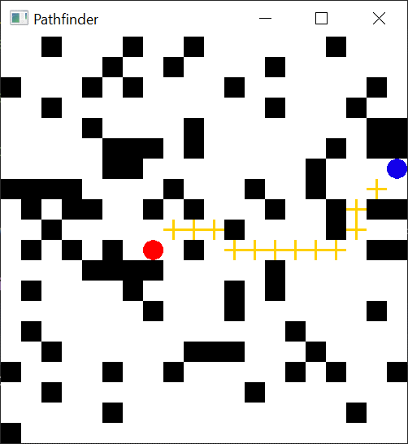
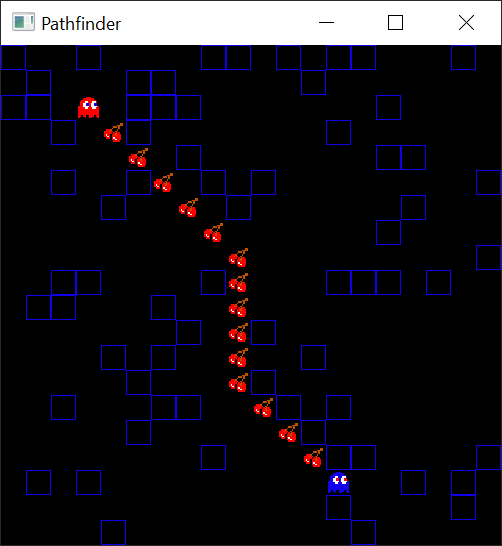

# Pathfinder
Pathfinder is C++ based 2D pathfinder simulator. It consists of a *runner* (controlled by the player) and a *tracker* which follows the runner using the shortest available path. 

Shortest path is found using the principles of [A* search algorithm](https://en.wikipedia.org/wiki/A*_search_algorithm). The program also allows placing and removing blocks/tiles, switching between players, pausing (<kbd>space</kbd>) and generating a new random map (<kbd>shift</kbd>).

Map loading uses a [*tileset*](assets/images/) standard to load. New tile sets can be created but should follow existing format.

<p align="center">
  </img>
  </img>
</p>

<hr>
<p align="center">
  
  
</p>


## Prerequisites
The program was developed in [C++14](https://en.cppreference.com/w/cpp/14). Additionally, the [SFML](https://www.sfml-dev.org/) library was used for graphics and audio.


## Getting Started
To run the program, download and unzip [Pathfinder.zip](Pathfinder.zip). You should expect the directory below:

```
+-- Pathfinder
|   +-- Pathfinder - Shortcut.lnk
|   +-- App
|   |   +-- assets
|   |   +-- Pathfinder.cbp
|   |   +-- Pathfinder.exe
|   |   +-- sfml-audio-2.dll
|   |   +-- sfml-graphics-2.dll
|   |   +-- ...
```

Running the **Pathfinder** shortcut should be enough to access the program. Alternatively the **Pathfinder.exe** could be run.


## Used Modules
- *main.ccp* - main function launching the app
- *appWindow.hpp*, *appWindow.ccp* - pathfinder app window
- *map.hpp*, *map.ccp* - pathfinder map class and related functions
- *pathfinder.hpp*, *pathfinder.ccp* - implementation of the A* algortihm and its heuristic
- *pixel.hhp*, *pixel.ccp* - individiual map pixel/tile class


## Future Improvements/Sophistications
- **Movable Blocks** - a new type of block that can be moved by both runner and tracker, tracker's path cost increases when moving blocks
- **Multiple Trackers** - more than one tracker tries to catch on to the runner


## Details
- Author - Arastun Mammadli
- License - [MIT](LICENSE)
